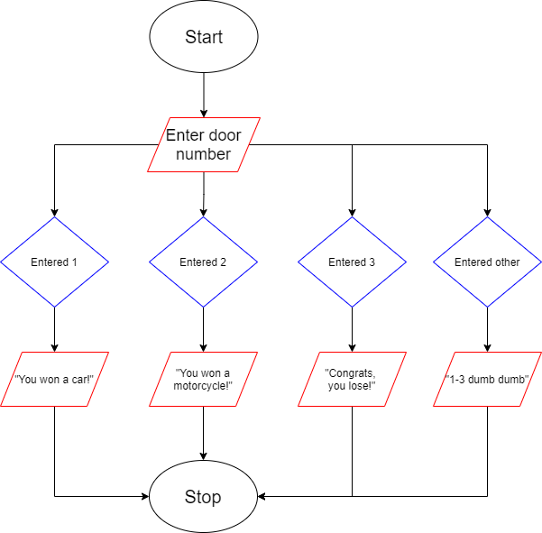

# Chapter4and5

3.1 - Using an unnecessary nested selection structure, reversing an outer and nested structure and writing compund conditions rather than nested selection structures.

3.2 - Using unnecessary statements in the nested selection structure while correct, is inefficent and not standard.

3.3

<h1>DiscussionQuestions</h1>

3.10 - It is extremely hard to code program that involve running through high amounts of data in terms of processing, printing, or logging.

3.11 - Advantages of using switch statement is it may include as many cases as necessary, and are able to contain any number of 
variables, functions and methods. Disadvantages of switch statement are things such as needing a consistent data type, and requires 
precise 'break' placements, otherwise an infinite loop will take place.

3.12 - While loops are useful because they are a pretest type of loop; meaning they evaluate the conditional before the loop is
executed.

3.13 - Idk what the game loop is, but what I do know is that plenty of iconic games use loops in order to accomplish rendering and 
process tasks.

3.14 - Infinite pose an issue and are considered bad because of they're ineffciency. Infinite or endless loops pull resources and limit your program by slowing it down or even stopping it entirely.

